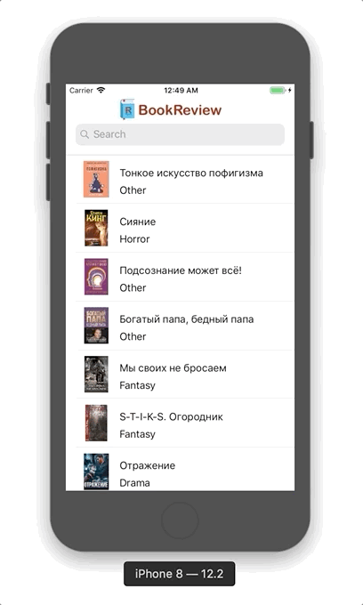

# BookReview

Приложение для обзор книг(описание их и демонстрации первых страниц) 
> Данное прилодение сфокусированно исключительно на бэкенде, и его фронтенд не предназначен для демонстрации моих навыков
(сделан минимальный быстрый дизайн) и слуэжит лишь для доступа к функционалу бэкенда.

## Функции
* Поиск книги по названию с использованием `UISearchController`
* Поиск книги по категории при помощи `SearchBar`
* Парсинг json при помощи `LocalService`
* Увеличение и уменьшение изображения за счет `UIScrollView`, а также по 2-му тапу через `UITapGestureRecognizer` 

## Демонстрация 

